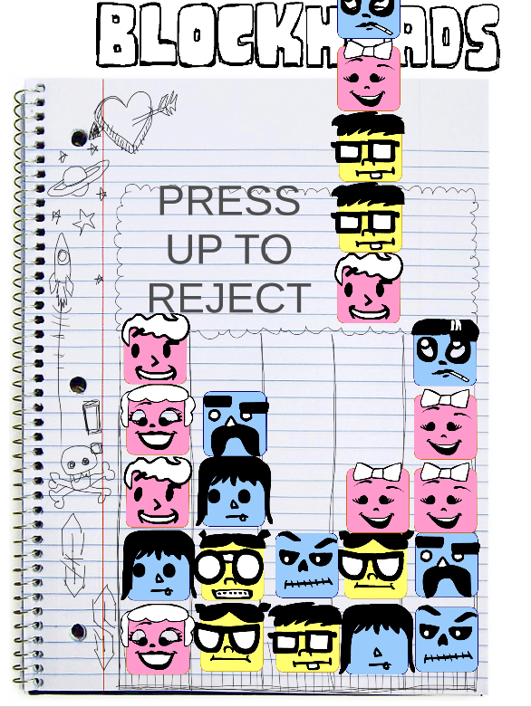

# Blockheads

Play and comment here: <https://ldjam.com/events/ludum-dare/41/blockheads>

How fast can you match all blockheads?

- Clear all blockheads to win the level.
- Press down to accept.
- Press up to reject.
- Play all four levels.

Credits:

- Audio: Kathy Qianqian Jin, Lin Zeng, and Thomas Soto
- Illustration: Corey Jackson
- Animation: Toby Hefflin
- Engineering: Ethan Kennerly

Coworking space hosted by GluPlay, the creator of Cooking Dash and Restaurant Dash.

Game software: Animation runtime: Spine, Tween engine: DOTween, Game engine: Unity.

Ludum Dare game jam, April 20th - 22nd, 2018.
